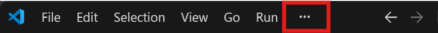
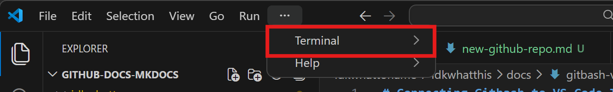
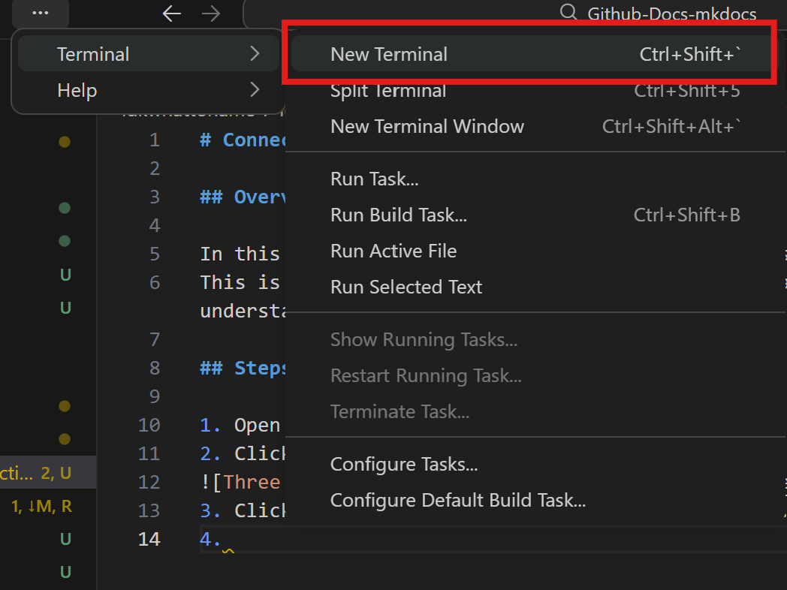
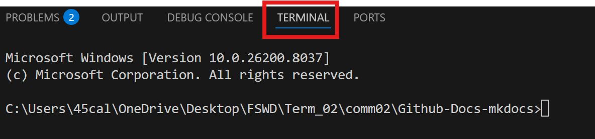
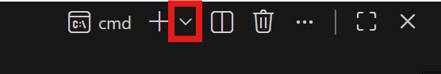
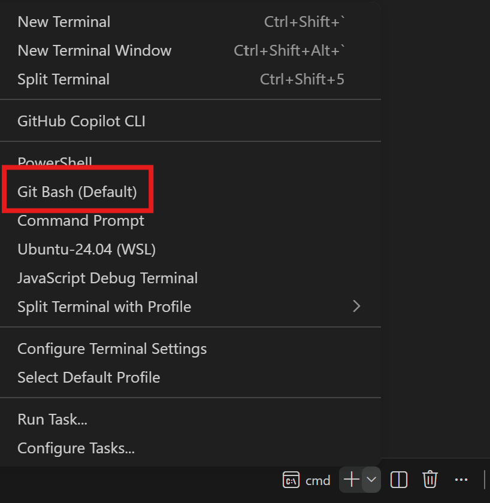

# Connecting Gitbash to VS Code Terminal

## Overview

In this section we will learn how to connect Gitbash to our VS code terminal.
This is because the documentation is uses the Gitbash terminal for demonstration. If you already have an understanding of using VS code and other terminals you can skip this part of the documentation.

## Steps

1. **Double Click** on Visual Studio Code to open it.
2. **Click** on the three dots at the top left.

3. **Click** on the terminal option from the drop down. 
4. **Select** `New Terminal` from the side pop-up list. 
5. A window should appear on the butom of the console - **navigate** to it.
6. **Click** on the terminal option from the menu.
7. **Click** on the drop down arrow on the right next to the plus sign. 
8. **Check** if Git Bash is listed and **Select** it from the pop-up menu. 
9. If it's not listed add it manually by following these steps:

10. Press Ctrl + Shift + P to open the Command Palette
11. Search for: “Preferences: Open Settings (JSON)”
12. Add the following configuration:

```"terminal.integrated.profiles.windows": {
    "Git Bash": {
        "path": "C:\\Program Files\\Git\\bin\\bash.exe"
    }
}
```

## Set Git Bash as Default Terminal

1. After adding it, go back to Select Default Profile and choose Git Bash.
2. Open a New Terminal Session
3. Click New Terminal (+) again.
4. You should now see Git Bash running inside VS Code.
