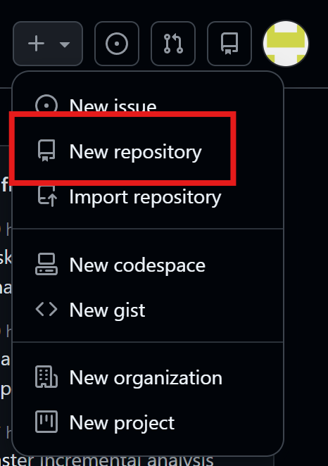
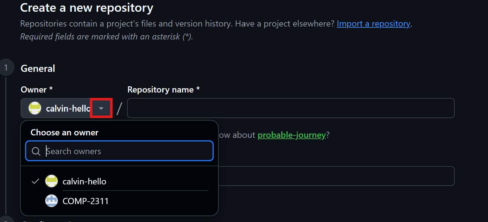
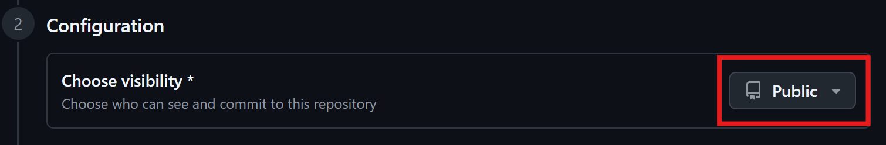
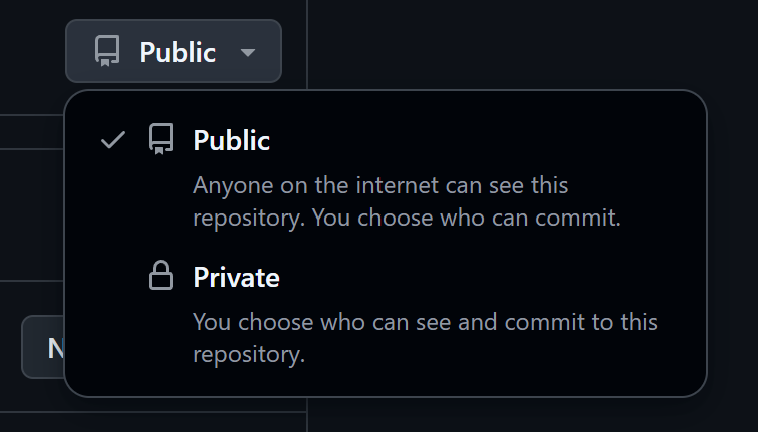

# Creating a New Repository in Github

## Overview

This section guides users through the process of creating a new GitHub repository, allowing them to store, manage, and track their project files using version control.

## Steps

1. **Navigate** to [GitHub](https://github.com) and sign up.
2. **Click** on the "+" icon in the top-right corner of the navigation bar.
3. **Select** “New repository.” 
4. **Click** on the down arrow to choose a Repository Owner from the drop down list 
5. **Type** a Repository Name
6. **Add** a Description (Optional)
    - Provide a short summary explaining the purpose of the repository.

## Set Repository Visibility

1. **Click** on "public" 
2. **Choose** between:
    - Public (visible to everyone)
    - Private (only accessible to you or collaborators)
    

## Initialize the Repository (Recommended)

1. Check the option to add a README file. This helps set up the repository structure immediately.
2. Add a .gitignore File (Optional)

## Choose a License (Optional) and Create Repository

1. **Select** an open-source license if you want others to use or contribute to your project.
2. **Click** the “Create repository” button to finalize.